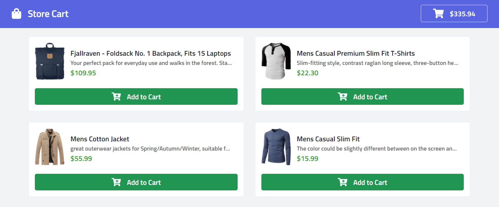

<p align="center">
   
</p>

<video src='.github/assets/fake-store-pc.mp4' width=180/>
<video src='.github/assets/fake-store-reponsive.mp4' width=180/>

# Fake Store Cart

#### 📌 About

- Store Cart, the best offers for you - Using Fake Store API

#### 🛒 Deploy on Vercel

- [Production](https://fake-store-cart.vercel.app/)

#### 🧑‍💻 Technologies

- [Next.js Documentation](https://nextjs.org/docs)
- [Typescript](https://www.typescriptlang.org/docs/)
- [FakeStoreAPI](https://fakestoreapi.com/docs)
- [Jest](https://jestjs.io/docs/en/getting-started)
- [Cypress](https://docs.cypress.io/guides/overview/why-cypress)

#### ⚙️ Getting Started

First, run the development server:

```bash
yarn dev
```

Open [http://localhost:3000](http://localhost:3000) with your browser to see the result.

#### 📋 Tests

For run jest tests:

```bash
yarn test
```

For run cypress tests:

```bash
yarn cypress
```
